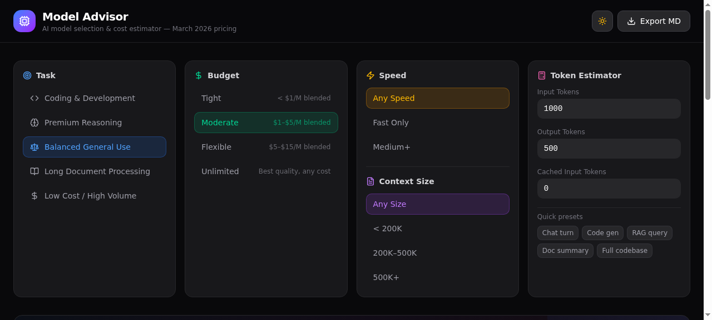

# 🧠 Model Advisor

**AI model selection & cost estimator for Zo Computer**

Choose the best AI model based on task, budget, speed, and context size. Get instant recommendations with detailed comparisons and cost projections.


[](https://dagawdnyc.zo.space/model-advisor)
[](LICENSE)



## ✨ Features

- 🎯 **Smart Recommendations** — Scored model matching based on your criteria
- 💰 **Token Cost Estimator** — Per-request cost with 1K/10K/100K projections
- 📊 **Sortable Comparison Table** — All 8 models side-by-side with expandable details
- 🌓 **Dark/Light Mode** — Toggle with smooth transitions
- 📥 **Export to Markdown** — Download a full report
- ⚡ **Quick Presets** — Chat turn, Code gen, RAG query, Doc summary, Full codebase

## 🤖 Models Covered (March 2026 Pricing)

| Model | Provider | Input/1M | Output/1M | Context |
|-------|----------|----------|-----------|---------|
| GPT-5.4 mini | OpenAI | $0.75 | $4.50 | 400K |
| GPT-5.4 | OpenAI | $2.50 | $10.00 | 272K |
| GPT-5.3 Codex | OpenAI | $1.75 | $14.00 | 400K |
| Opus 4.6 | Anthropic | $5.00 | $25.00 | 1M |
| Sonnet 4.5 | Anthropic | $3.00 | $15.00 | 200K |
| Gemini 3 Pro | Google | $2.00 | $12.00 | 200K |
| Kimi K2.5 | Moonshot AI | $0.60 | $3.00 | 262K |
| MiniMax 2.7 | MiniMax | $0.30 | $1.20 | 1M |

## 🚀 Install on Zo Computer

### One-Line Install

```bash
bun run Skills/model-advisor/scripts/install.ts
```

### Install from GitHub

```bash
# Clone into your Skills directory
cd Skills
git clone https://github.com/KaiyzerBX50/model-advisor.git

# Deploy to your zo.space
bun run model-advisor/scripts/install.ts
```

### Options

```
--path <path>   Route path (default: /model-advisor)
--private       Make the page private (owner-only)
--help          Show help
```

### Or Just Ask Zo

> "Install the model-advisor skill to my space"

## 🏗️ Architecture

- **Runtime:** Zo Space (React + Tailwind CSS 4)
- **Dependencies:** None (uses pre-installed zo.space packages)
- **Icons:** lucide-react
- **State:** React hooks (useState, useMemo, useCallback)
- **Theming:** Context-based dark/light mode

## 📁 Structure

```
model-advisor/
├── SKILL.md              # Zo skill manifest
├── README.md             # This file
├── LICENSE               # MIT License
├── assets/
│   └── model-advisor.tsx # Full page source code
└── scripts/
    └── install.ts        # One-click installer
```

## 🛠️ Customizing

Edit `assets/model-advisor.tsx` to:
- Add/remove models in the `MODELS` array
- Adjust scoring weights in `scoreModel()`
- Modify task categories in `TASKS`
- Update pricing data

Then re-run the install script to redeploy.

## 📄 License

MIT — use it however you want.

---

Built with [Zo Computer](https://zo.computer) ⢕⣿⣏⣿⢳⡕⣆⢺⣋⢟
